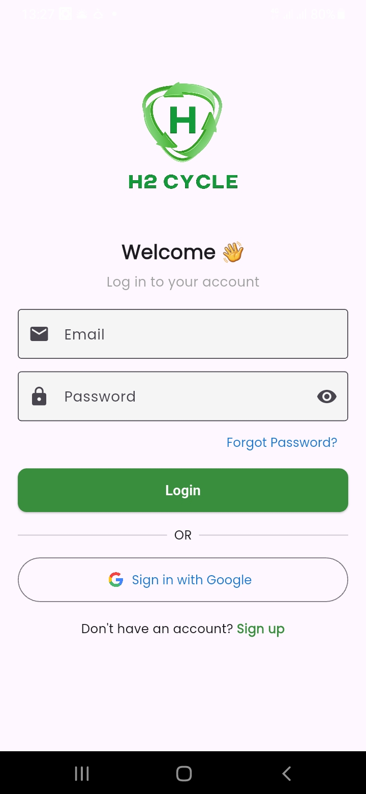
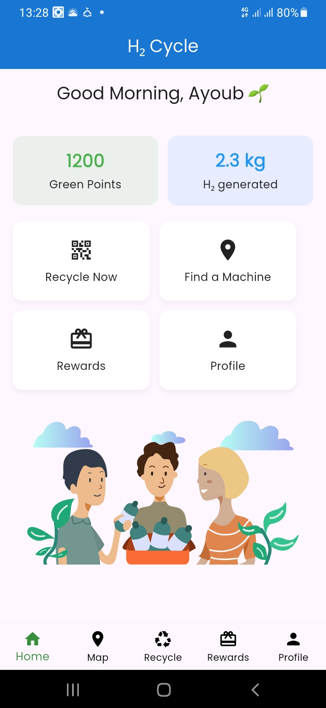
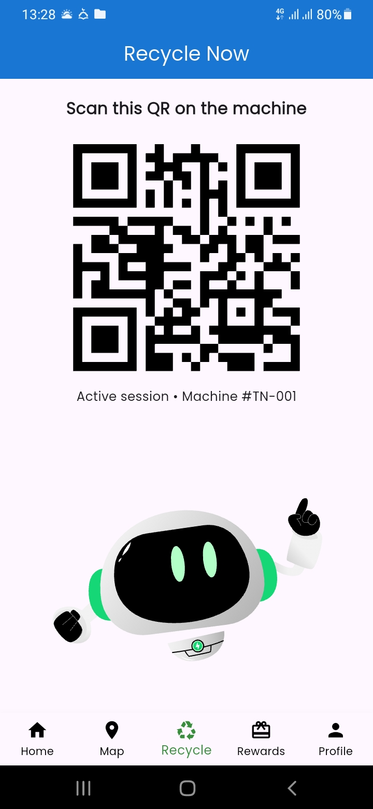
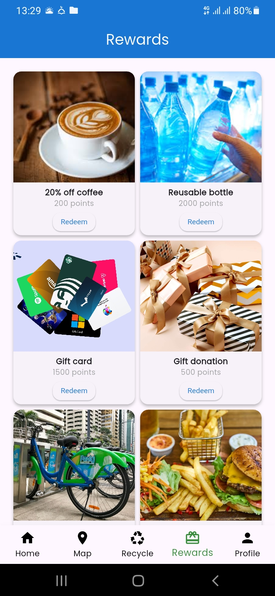

# ♻️ H₂Cycle – Smart Recycling & Hydrogen Rewards App

A mobile app that connects **smart plastic collection machines** with users who want to recycle.  
Our innovation: **turning plastic waste into hydrogen fuel**, while rewarding users with points and prizes.  

---

## 📌 Project Overview
The **H₂Cycle App** allows users to:
- Locate the nearest smart collection machines.
- Deposit plastic waste and earn rewards instantly.
- Track their environmental impact (CO₂ saved, kg of plastic recycled).
- Redeem points through partner companies.
- Contribute to the production of hydrogen energy from waste.

This project is part of our **startup journey** combining **IoT, green tech, and circular economy**.

## ⚙️ Setup Instructions
1. **Clone this repository**  
   ```bash
   git clone https://github.com/YourUsername/H2_Cycle_App.git
   cd H2_Cycle_App
2. Install dependencies
   ```bash
    flutter pub get
4. Add Firebase config files
   .) google-services.json (for Android → /android/app/)
   .) GoogleService-Info.plist (for iOS → /ios/Runner/)
5. Run the app
   ```bash
   flutter run
## ✨ Features
✅ User authentication (Email & Google Sign-In)

✅ Smart machine connection via QR code

✅ Real-time points & rewards system

✅ Interactive map to locate machines

✅ Recycling history & environmental impact tracker

✅ Wallet integration for points & rewards

✅ Modern UI with Flutter & Firebase backend

## 📂 Folder Structure
H2_Cycle_App/
│
├── lib/
│   ├── main.dart
│   ├── routes.dart
│   ├── app_state.dart
│   ├── pages/
│   │   ├── login_page.dart
│   │   ├── register_page.dart
│   │   ├── home_page.dart
│   │   ├── recycle_page.dart
│   │   ├── map_page.dart
│   │   ├── rewards_page.dart
│   │   ├── profile_page.dart
│   │   ├── wallet_page.dart
│   │   └── edit_profile_page.dart
│   └── widgets/
│       ├── h2cycle_logo.dart
│       ├── primary_button.dart
│       └── custom_card.dart
│
├── assets/
│   ├── images/
│   ├── fonts/
│   └── animations/
│
├── login.jpg
├── home.jpg
├── qr.jpg
├──rewards.jpg
├──demo_video.mp4  
│
├── .gitignore
├── pubspec.yaml
├── README.md
└── LICENSE


## 🖼️ Screenshots
| Login Page                           | Home Dashboard                     | QR Scan                             | Rewards                                  |
| ------------------------------------ | ---------------------------------- | ----------------------------------- | ---------------------------------------- |
|  |  |  |  |

## 🚀 Future Roadmap
🔹 Machine Learning for better waste recognition

🔹 Carbon credit trading system for enterprises

🔹 Blockchain integration for reward transparency

🔹 Expansion to other waste streams (glass, cans, e-waste)

🔹 International deployment beyond Tunisia

## 👨‍💻 Contributors
Ayoub Soltani – Lead Developer & Project Founder

H₂Cycle Team – Sustainability & Business Strategy

## 📜 License
This project is licensed under the MIT License – feel free to use and adapt with attribution.
